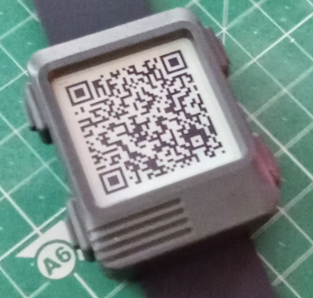

# WatchySevevenSegment Watch Face

Firmware/Watch Face for the [SQFMI Watchy](https://watchy.sqfmi.com/) open source e-paper watch.

This Watch Face displays time with digits, similar to seven segment displays. In functionality and appearance, the watch face
is similar to the basic 7Seg example and others. Rather than using a font that looks similar to an old display
in this code, objects are used to model the individual LED/segments 
of such a display, using the conventional labelling of these (A,B,C,D,E,F and G). To display `1` on a digt, the code turns
segments `B` and segment `C` on and leaves all the rest off....

## Features
Not many!
- 12 Hour time display
- 24 Hour time display
- Date of the month
- QR code time display
- QR code link to this GitHub project
- Traditional analoge display

To cycle through the different time displays, press the lower right button. To display a QR code for the URL to this project,
press the top right button. To return to the time display, press the lower right button.

## Implementation
The code was written for and in, PlatformIO. If using the Arduino environment, you'll need to rename main.cpp to something with
an .ino extension. Whilst initially debugging challenges I was having, I setup a an Arduino environment and used this approach
with no issue but all recent work has been performed in PlatformIO.

SevenSegmentDigit is the main class that represents a 7 segment display. FourDigitDisplay makes use of this to represent the
four digit display, with a central colon, used in conventional bedside alarm clocks.

QR codes are generated using the [QRCode](https://github.com/ricmoo/QRCode) library. Very straightforward to use. 
Idea of displaying time using a QR Code .... shamelessly taken from the excelent [QR_Watchface](https://github.com/Cqoicebordel/Watchfaces/tree/main/QR_Watchface)!
