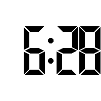
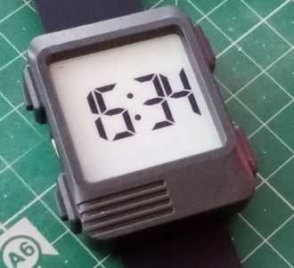

# WatchySevevenSegment Watch Face

Firmware/Watch Face for the [SQFMI Watchy](https://watchy.sqfmi.com/) open source e-paper watch.

This Watch Face displays time with digits, similar to seven segment displays. In functionality and appearance, the watch face
is similar to the basic 7Seg example and others. The difference is that the conventional way to achieve this style is to use
a font that mimics such a display. This code uses a different approach. Objects are used to model the individual LED/segments 
of a typical display, using the conventional labelling of these (A,B,C,D,E,F and G).

## Features
Not many!
- 12 Hour time display
- 24 Hour time display
- Date of the month
- QR code time display
- QR code link to this GitHub project

To cycle through the different time displays, press the lower right button. To display a QR code for the URL to this project,
press the top right button. To return to the time display, press the lower right button.

##Implementation
The code was written for and in, PlatformIO. If using the Arduino environment, you'll need to rename main.cpp to something with
an .ino extension. Whilst initially debugging challenges I was having, I setup a an Arduino environment and used this approach
with no issue but all recent work has been performed in PlatformIO

SevenSegmentDigit is the main class that represents a 7 segment display. FourDigitDisplay makes use of this to represent the
four digit display, with a central colon, used in conventional bedside alarm clocks.
