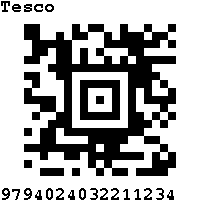

# WatchySevevenSegment Watch Face

&nbsp;

&nbsp;

Firmware/Watch Face for the [SQFMI Watchy](https://watchy.sqfmi.com/) open source e-paper watch.

The initial mode of this Watch Face displays time with digits, similar to seven segment displays. In functionality and appearance, the watch face
is similar to the basic 7Seg example and others. Rather than using a font that looks similar to an old display,
in this code, objects are used to model the individual LED/segments 
of such a display, using the conventional labelling of these (A,B,C,D,E,F and G). To display `1` on a digit, the code turns
segments `B` and segment `C` on and leaves all the rest off....

"Flags" are used to display status information (12 Hour/24 Hour AM....) with this text displaying in
consistent locations, in the way that an LCD watch of the 80s might.

## Features
The following modes:
- 12 Hour time display
- 24 Hour time display
- Date of the month
- Seconds
- Stopwatch
- Battery voltage
  
are cycled through, by pressing the bottom right button. Whilst in the stopwatch mode, top right button
starts the timer. Pressing top right again leaves the timer running but pauses the screep update. The "LAP"
flag is displayed. Further press of top right resumes the normal running of the stopwatch. To reset a running
timer, pause the timer ("LAP" displayed) then press the top left button. Confirmation of the operation of the
stopwatch functions, is provided by brief vibrations.

Top right button, displays:
- Analog watch
- QR code linking back to this GitHub repository
- QR code displaying time and in the QR code, debug information for the status of the watch
  
pressing the top right button cycles through these screens.

Top left button, displays loyalty cards information. To add/modify the QR, Code 128, Aztec cards displayed. Look for
the `LoyaltyCard` object array in main.cpp.

## Implementation
The code was written for and in, PlatformIO. If using the Arduino environment, you'll need to rename main.cpp to something with
an .ino extension. Whilst initially debugging challenges I was having, I setup a an Arduino environment and used this approach
with no issue but all recent work has been performed in PlatformIO.

SevenSegmentDigit is the main class that represents a 7 segment display. FourDigitDisplay makes use of this to represent the
four digit display, with a central colon, used in conventional bedside alarm clocks.

QR codes are generated using the [QRCode](https://github.com/ricmoo/QRCode) library. Very straightforward to use. 
Idea of displaying time using a QR Code .... shamelessly taken from the excelent [QR_Watchface](https://github.com/Cqoicebordel/Watchfaces/tree/main/QR_Watchface)!

The Code 128 barcodes are generated from scratch and has basic support for Code Set A and Code Set C. The Aztec barcode has also
been written from scratch. The code does just enough to display a level 2, compact, numeric code. Enough to display the digits
of a Tesco loyalty card!
